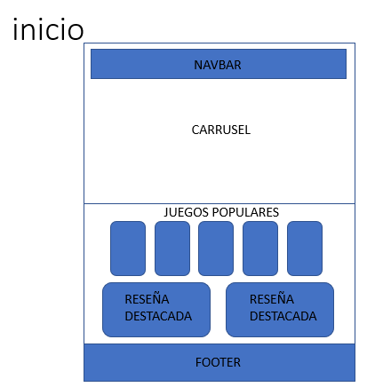
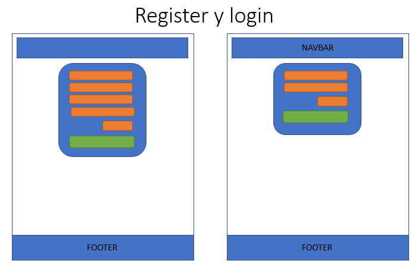
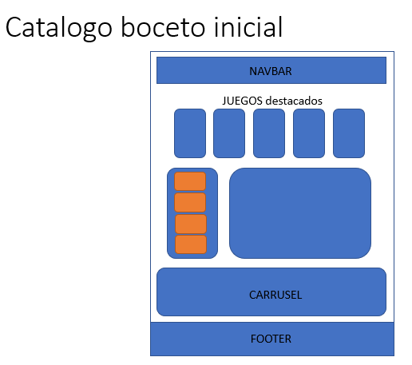
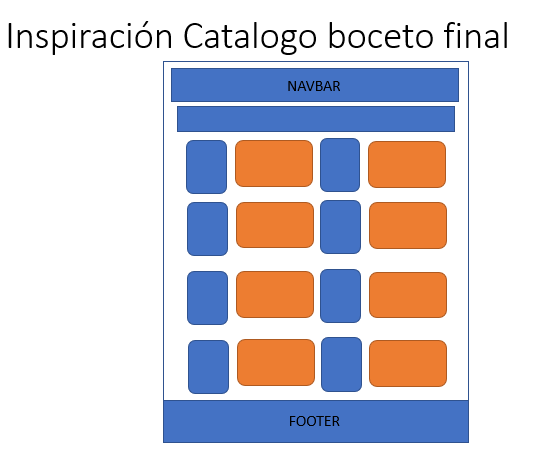
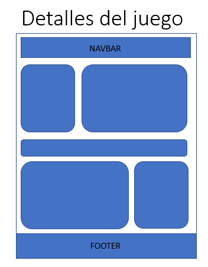

# 🎮 PlayTales

Una aplicación web creada con React orientada a amantes de los videojuegos. Permite navegar por un catálogo de juegos, ver detalles, iniciar sesión y más. Diseñado como proyecto final del curso de React_Front-End.

---

## ✨ Tecnologías Utilizadas

- **React** + Vite
- **React Router DOM** – Ruteo de las páginas
- **Tailwind CSS** – Estilos personalizados y responsivos
- **Ant Design (antd)** – Componentes UI como formularios, carrusel y layout
- **React Hook Form** – Manejo de formularios
- **Iconify** – Íconos decorativos

---

## 📄 Páginas del proyecto

- `/` → Página de **Inicio** (Home)
- `/catalogue` → Catálogo con tarjetas de juegos
- `/login` → Formulario de inicio de sesión
- `/register` → Formulario de registro
- `/gamedetails/:id` → Página de detalle individual de cada juego

---

## 🖌️ Wireframes / Bocetos

### 🏠 Home


### 🔐 Login and Register


### 🗂️ Catalogue


### 🎮 Game Details


> Estos bocetos ayudaron a definir la estructura visual y disposición de cada página antes del desarrollo final.

---

## 📄 Páginas principales

### 🏠 Home
- Carrusel de juegos destacados
- Sección de reseñas destacadas
- Juegos populares aleatorios

### 🕹️ Catalogue
- Tarjetas de juegos renderizadas desde un mock
- Diseño responsive y atractivo

### 📝 Login
- Inicio de sesión con email y contraseña
- Alertas personalizadas con `sweetalert2`
- En un futuro: Protección de rutas (acceso a dashboard restringido si no estás logueado)

### 🧾 Register
- Registro de nuevos usuarios
- Validación de campos con React Hook Form
- Diseño similar al login para mantener consistencia

### 🕵️‍♀️ GameDetails
- Página individual para cada juego
- Información detallada
- Reseñas estilo Steam
- Navegación intuitiva con `react-router-dom`

---

## 🧠 Funcionalidades destacadas

- ⚡ Mock de juegos con datos como imágenes, reseñas, géneros, duración, etc.
- 👤 Inicio de sesión y registro funcionales con validaciones
- 🔐 Estado global del usuario con `UserContext`
- 🧩 Carrusel personalizado en Home
- 💬 Reseñas destacadas y aleatorias en la página principal
- 🌌 Estética visual basada en temas oscuros con sombras neón y SVG decorativos


## 🚀 Cómo ejecutar el proyecto

1. Clona el repositorio:
   ```bash
   git clone https://github.com/tuusuario/playtales.git


## ✨ Autor

**Lina Garnica** – Desarrolladora Frontend y futura creadora de videojuegos 🚀🎮  
[GitHub](https://github.com/vivsbee)


<p>Si le gustó el contenido del repositorio, ¡apóyanos dando una ⭐ al proyecto!</p>